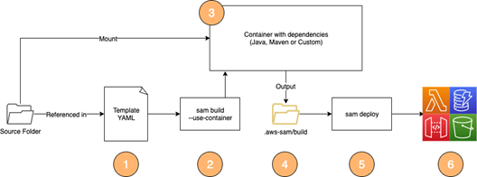

# 03-maven-graalvm-custom

## Description

Building a native executable using GraalVM inside a custom Docker container



## Instructions

Build a custom build image as referenced in the [Dockerfile](Dockerfile).

```bash
docker build . -t sam/custom-graal-image
```

Build the application via the custom build image:

```bash
sam build --use-container --build-image sam/custom-graal-image
```

Deploy the application:

```bash
sam deploy --guided
```

Test the application:

```bash
aws lambda invoke --function-name 03-maven-graalvm-custom /dev/stdout | cat
```

## Reference

Please follow the [blog post](https://aws.amazon.com/blogs/compute/building-serverless-java-applications-with-the-aws-sam-cli/) for additional information.