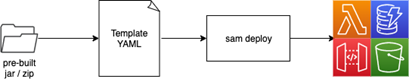

# 04-maven-skip-sam-build

## Description

Deploying a jar file that has been built outside the SAM build process



## Instructions

Build the package on your own via:

```bash
mvn clean package -f HelloWorldFunction/pom.xml
```

Deploy the application directly without sam build:

```bash
sam deploy --guided
```

Test the application:

```bash
aws lambda invoke --function-name 04-maven-skip-sam-build /dev/stdout | cat
```

## Reference

Please follow the [blog post]() for additional information.