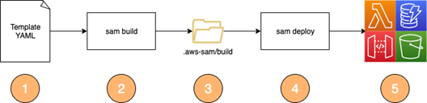

# Building Serverless Java applications with the AWS SAM CLI

In this project, we provide examples of the different methods that are available to build java applications using AWS SAM.

Refer to the [Building serverless Java applications with the AWS SAM CLI]() blog post for a details of these examples.

To use the example code the following dependencies need to be installed:
* [AWS SAM CLI](https://docs.aws.amazon.com/serverless-application-model/latest/developerguide/install-sam-cli.html)
* [Java 11 SDK](https://docs.aws.amazon.com/corretto/latest/corretto-11-ug/downloads-list.html)
* [Apache Maven](https://maven.apache.org/)

The example projects demonstrate the following:
- 01-maven-default: Standard maven pom build and package for Java.
- 02-maven-uberjar: Using maven-shade-plugin to package an uber-jar and deploy to AWS Lambda using a Makefile.
- 03-maven-graalvm-custom: Building a native executable using GraalVM, run inside a custom docker container.
- 04-maven-skip-sam-build: Deploying a jar file that has been built outside the SAM build process.

## Security

See [CONTRIBUTING](CONTRIBUTING.md#security-issue-notifications) for more information.

## License

This library is licensed under the MIT-0 License. See the LICENSE file.

